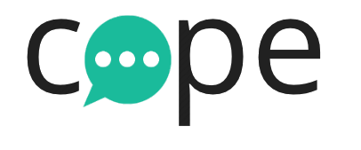

# 

Cope is a full-stack project developed by ***Team Cat Fight Club*** at [DigitalCrafts](https://github.com/DigitalCrafts), comprised of [Autumn](https://github.com/AutumnColeman), [Matt](https://github.com/mwdowns), and [Eli](https://github.com/eluttrell).

## Try It Out!
The more people using it, the better it gets, try it out for yourself at our [live site](cope-app.org).

## How It Came About
The project was originally thought up by Autumn as a means for people who needed someone to talk to about personal issues they might be having. Frequently people can be going through very difficult or emotional experiences, and yet will feel that they have no one that they can confide their feelings in, or at least not anyone who is willing or able to truly listen. ***Cope*** is meant to offer a platform for people who either need someone to listen and empathize with them and offer advice when appropriate, and also for people who enjoy helping others and want to better the world around them.

## How It Was Built
This project covered a lot of uncharted territory for our team. We were all familiar with HTML and CSS, and we had become fairly familiar with Javascript and AngularJS. However, all of our previous full stack projects had been completed using Python and Flask on the backend, but on this project we decided to use NodeJS, even though we'd never used it before. In addition to our self assigned crash course in NodeJS, we also decided to make use of SocketIO, a Javascript library for realtime web applications. We only had about four days to complete the project, and the short timeframe in addition to the new technologies we had to learn made for a rather frenetic week, but it was all told an immensely enjoyable experience, and we certainly learned a great deal.

### Individual Contributions
We were a small team, and had to carefully divvy up the workload to bring the project to fruition. We spent the first day familiarizing ourselves with the basics of SocketIO by following tutorials on the Socket.io website and a good tutorial series we found on YouTube by [Smitha Milli](https://www.youtube.com/watch?v=pNKNYLv2BpQ&index=32&list=WL&t=648s). The next day we split up, with Matt delving deeper into SocketIO documentation in order to build up the specific functionality we were looking for, while Autumn and I tried to learn as much about NodeJS as we could. Throughout the project we all tried to write as much well commented code as we could so that subsequent readers could follow our thinking, and also to improve our own understanding of all that we were doing. Day three had us bringing our two halves of the project together, which was fun, if not somewhat frustrating at times. The greatest difficulty we had was on day four, when we deployed the project through Amazon Web Services. We had deployed sites previously, but only with Python and Flask apps. Deploying with NodeJS was not vastly different, but we still experienced many setbacks. Ultimately we got the site up and running, while still maintaining the basic functionality we had achieved in the development stage. Some difficulties arose in finding the proper packages via npm and in working with different branches through github.

## How It Works
For those who feel thoughts or circumstances weighing on them, it is a simple and easy process to signup and be paired with someone who is ready and willing to help and listen. Similarly, for those who wish to help people in need, the process is similarly quick and streamlined.

## First & Subsequent Steps
The landing page for the site gives you a brief description of our goal and the option of either signing up or logging in.

Once logged in as someone seeking help, you can either view your profile page, which will give you the option of viewing previous conversations you have had that you chose to keep, or of going directly to talk with someone via the "SOS" button.

If you log in as someone interested in helping, you will be taken first to your profile page where you can edit your basic information, then from there you will be dropped into a "pool" of listeners who are ready to be paired with those seeking help as soon as you are needed.

##
